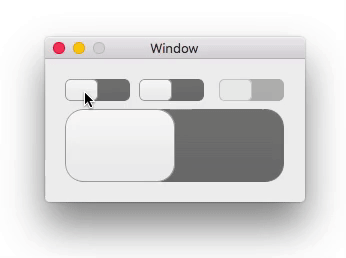

# GNJSwitchControl

`GNJSwitchControl` is a subclass of `NSControl` which has on/off state. By clicking a switch control or dragging a knob to change state.

## Usage

1. Add a Custom View (`NSView`) to other view in Interface Builder/Storyboard.
2. Set the Custom Class to `GNJSwitchControl`.